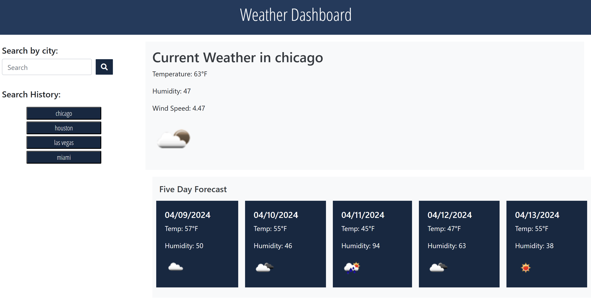

# Weather-Dashboard

## Acceptance Criteria

GIVEN a weather dashboard with form inputs
WHEN I search for a city
THEN I am presented with current and future conditions for that city and that city is added to the search history
WHEN I view current weather conditions for that city
THEN I am presented with the city name, the date, an icon representation of weather conditions, the temperature, the humidity, and the wind speed
WHEN I view future weather conditions for that city
THEN I am presented with a 5-day forecast that displays the date, an icon representation of weather conditions, the temperature, the wind speed, and the humidity
WHEN I click on a city in the search history
THEN I am again presented with current and future conditions for that city

## Usage
Link for repo:

Link for web: 

## Try Outs
When entering a city name the dashboard will display current weather and what the weather will be the next five days from current date.

When you search for your city the dashboard will display any history on the left side

Under the five days it will display the date, temp and humidity. It will also display small image showing the weather.

Under the current date it will display the date, temp, humidity and wind speed.

## Screenshots

